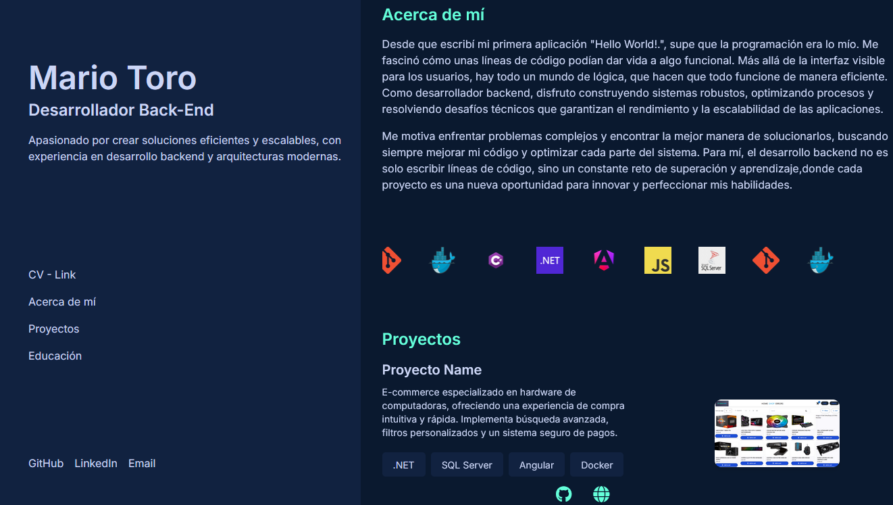

# 🌐 Portafolio Web - Mario Toro  

Este es mi portafolio personal como desarrollador backend, diseñado para mostrar mi experiencia, proyectos y habilidades de manera clara y profesional.  

🚀 **[Ver en vivo](TU_ENLACE_AQUI)**  

## 🛠️ Tecnologías utilizadas  
- **HTML, CSS, JavaScript** para la estructura y comportamiento  
- **Tailwind CSS** para un diseño limpio y moderno  
- **FontAwesome** para iconos interactivos  
- **Animaciones y transiciones CSS** para mejorar la experiencia de usuario  

## 📸 Capturas  


## 🏗️ Instalación y uso  
Si deseas probarlo localmente, sigue estos pasos:  
```bash
git clone https://github.com/mario-alexx/portafolio.git
cd portafolio
